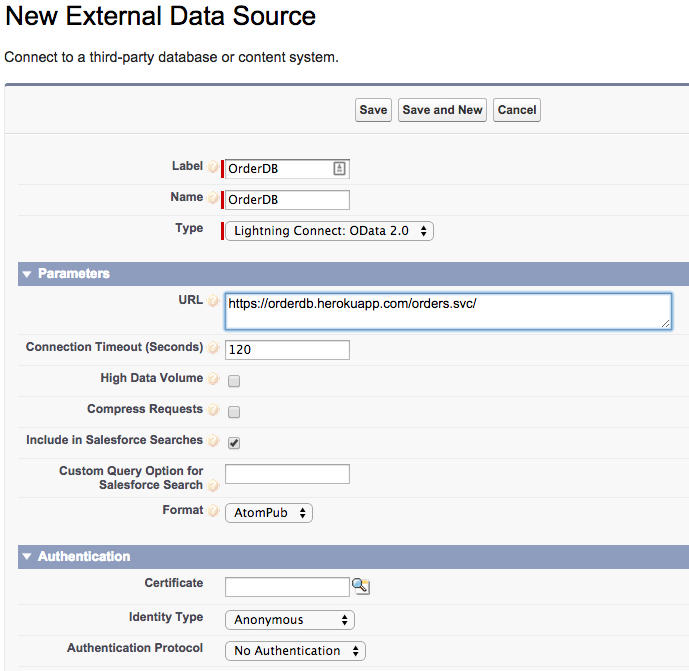
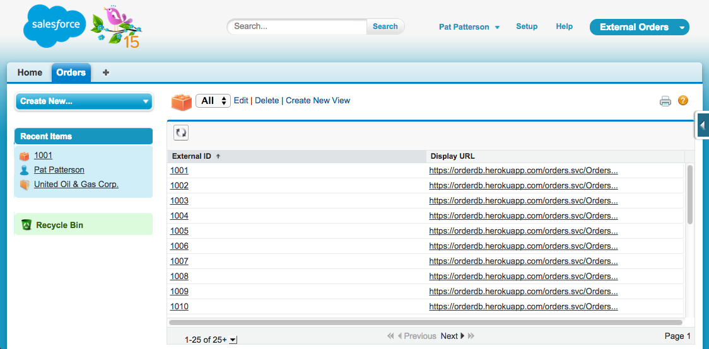
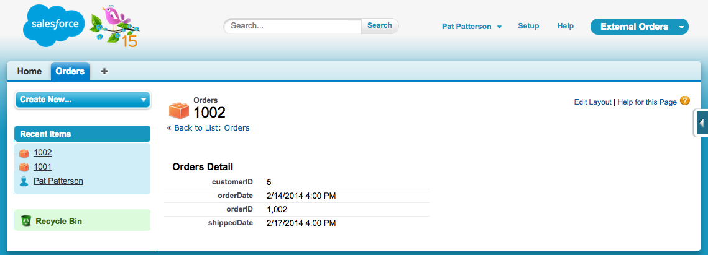

In this module, you will connect to an external database containing sample order data and show orders via external objects in Salesforce.

## What you will learn
- Configure an external data source in Salesforce
- Create external object definitions based on the external database schema
- Show external data in the Salesforce user interface

## Step 1: Configure an External Data Source

You can configure external data sources to connect Salesforce to outside systems. These might be off-the-shelf products and services, such as SAP, SharePoint or Jitterbit, or a bespoke integration using an OData library such as [odata4j](https://code.google.com/p/odata4j/).

1. Login to your Salesforce Developer Edition

1. Click **Setup** (upper right corner)

1. Click **Develop** > **External Data Sources** (left navigation)

1. Click **New External Data Source**

1. Enter **OrderDB** as the Label. As you click or tab away from the label field, the Name field should automatically default to OrderDB.

1. Select **Lightning Connect: OData 2.0** as the Type.

1. Enter **`https://orderdb.herokuapp.com/orders.svc/`** as the URL.

	

1. Leave the remaining settings with their default values and click **Save**

	> Since this is a sample, read-only database, no authentication is required. A real external system would likely require some credentials, and you can configure Lightning Connect to use the same set of credentials for all access to the data source, or seperate credentials for each user. See 'Identity Type' in the [online help](https://help.salesforce.com/HTViewHelpDoc?id=platform_connect_add_external_data_source.htm) for more details.

Now you've configured an external data source, you can select the tables you wish to integrate into your Salesforce environment.

## Step 2: Create External Objects

1. If you are not already on the OrderDB external data source page from the previous step, click **Develop** > **External Data Sources** and then click the OrderDB external data source.

1. Click **Validate and Sync**

	> Lightning Connect retrieves the sample database as OData 2.0 metadata and lists the available tables. [Click here](https://orderdb.herokuapp.com/orders.svc/$metadata) for a look at the metadata XML.

1. Select both **Order** and **OrderDetails**.

	

1. Click **Sync**

## Step 3: Inspect the External Object Configuration

1. If you are not already on the OrderDB external data source page from the previous step, click **Develop** > **External Data Sources** and then click the OrderDB external data source.

1. Scroll down to **External Objects** and click **Orders**

	

1. Lightning Connect created this external object from the order database's metadata. If you're familiar with custom objects, you'll notice that this looks very similar. Lightning Connect created a set of custom fields just as you might create them for a custom object. The key differences between external object and custom object definitions are:
	- External object API names have the suffix `__x` rather than `__c`
	- External objects have a reference to their external data source and a table within that source.
	- External objects have different standard fields. **Display URL** is the OData 2.0 URL representing a record in the external database, while **External ID** is the primary key value for each record.

	

## Step 4: Create a Custom Tab to Easily Access Order Records

1. Click **Setup** (upper right corner)

1. Click **Create** > **Tabs**

1. Click the **New** button next to **Custom Object Tabs**.

1. Select **Orders** as the Object.

1. Click the selector next to **Tab Style** and choose whichever style you like.

1. Click **Next**.

1. Click **Next** to accept the default tab visibility settings.

1. Click the checkbox next to **Include Tab** to deselect all the apps.

1. Click the checkbox next to **External Orders** to select it.

1. Click **Save**.

	> Note that there is also a standard object name "Order" and that this will result in two tabs with the label of "Orders."  You can change the tab name for your external object by changing the label in the object definition.

## Step 5: View the External Order Data

1. If the app menu (top right) is not already showing **External Orders**, then click the app menu and select it.

	

1. Click the Orders tab.

1. Click the **Go!** button next to View: All.

	

	Lightning Connect retrieved order ids for the first 25 order records from the sample order database.

1. Click one of the order external id values.

	

	Lightning Connect retrieved all the fields for the order you selected.

	> It's important to remember that external data is never duplicated in Salesforce. Lightning Connect always fetches current external data, in real-time.

Now we can see external data in Salesforce, we need to link it to existing data by creating *lookup relationships*.

<a href="create-developer-edition.html" class="btn btn-default"><i class="glyphicon glyphicon-chevron-left"></i> Previous</a>
<a href="create-lookup-relationships.html" class="btn btn-default pull-right">Next <i class="glyphicon glyphicon-chevron-right"></i></a>

